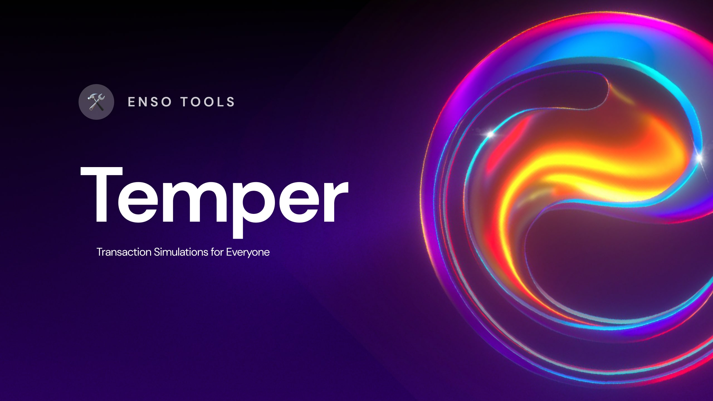

# Enso Transaction 🧐 Simulator 🧐

A simple API which simulates a given transaction request.

[](https://github.com/EnsoFinance/transaction-simulator/actions/workflows/test.yaml)



## 📫 API 📫

### POST /api/v1/simulate

Simulates a single transaction against a local EVM.

[See the full request and response types below.](#types)

Example body:

```json
{
  "chainId": 1,
  "from": "0xd8dA6BF26964aF9D7eEd9e03E53415D37aA96045",
  "to": "0x66fc62c1748e45435b06cf8dd105b73e9855f93e",
  "data": "0xffa2ca3b44eea7c8e659973cbdf476546e9e6adfd1c580700537e52ba7124933a97904ea000000000000000000000000000000000000000000000000000000000000006000000000000000000000000000000000000000000000000000000000000000a00000000000000000000000000000000000000000000000000000000000000001d0e30db00300ffffffffffffc02aaa39b223fe8d0a0e5c4f27ead9083c756cc200000000000000000000000000000000000000000000000000000000000000010000000000000000000000000000000000000000000000000000000000000020000000000000000000000000000000000000000000000000000000000000002000000000000000000000000000000000000000000000000000000000000186a0",
  "gasLimit": 500000,
  "value": "100000",
  "blockNumber": 16784600
}
```

Example response:

```json
{
  "gasUsed": 214622,
  "blockNumber": 16784600,
  "success": true,
  "trace": { ... },
  "logs": [ ... ],
  "exitReason": "Return"
}
```

Notes:

- `blockNumber` can be omitted and the latest block will be used, however providing a `blockNumber` is recommended where possible to use the cache.

### POST /api/v1/simulate-bundle

Simulates a bundle of transactions in order against the same EVM.

[See the full request and response types below.](#types)

Example body:

```json
[
  {
    "chainId": 1,
    "from": "0xd8dA6BF26964aF9D7eEd9e03E53415D37aA96045",
    "to": "0x66fc62c1748e45435b06cf8dd105b73e9855f93e",
    "data": "0xffa2ca3b44eea7c8e659973cbdf476546e9e6adfd1c580700537e52ba7124933a97904ea000000000000000000000000000000000000000000000000000000000000006000000000000000000000000000000000000000000000000000000000000000a00000000000000000000000000000000000000000000000000000000000000001d0e30db00300ffffffffffffc02aaa39b223fe8d0a0e5c4f27ead9083c756cc200000000000000000000000000000000000000000000000000000000000000010000000000000000000000000000000000000000000000000000000000000020000000000000000000000000000000000000000000000000000000000000002000000000000000000000000000000000000000000000000000000000000186a0",
    "gasLimit": 500000,
    "value": "100000",
    "blockNumber": 16784600
  }
]
```

Example response:

```json
[{
  "gasUsed": 214622,
  "blockNumber": 16784600,
  "success": true,
  "trace": { ... },
  "logs": [ ... ],
  "exitReason": "Return"
}]
```

Notes:

- `chainId` must be the same in all transactions.
- `blockNumber` must be the same in all transactions, or omitted in all transactions to use latest.

### Authentication

If you set an `API_KEY` environment variable then all calls to the API must be accompanied by a `X-API-KEY` header which contains this API Key.

## 🏃‍♂️ Running 🏃‍♂️

### Locally

Copy `.env.example` to `.env`, fill out required values and run:

```bash
$ cargo run
```

If you want the server to restart on any code changes run:

```bash
$ cargo watch -x run
```

## 🧪 Test 🧪

Run:

```bash
$ cargo test
```

### Manual Testing

`body.json` contains a simple request in the root of the project so once the API is running you can just run:

```bash
$ curl -H "Content-Type: application/json" --data @tests/body.json http://localhost:8080/api/v1/simulate
```

If you have `jq` installed, you can run this to see pretty traces:

```bash
$ curl -H "Content-Type: application/json" --data @tests/body.json http://localhost:8080/api/v1/simulate | jq -r ".formattedTrace"
```

## 🧭 Roadmap 🧭

- [ ] Support any RPC endpoint, not just Alchemy
- [ ] Connect to local node via IPC
- [ ] Connect to local [reth](https://github.com/paradigmxyz/reth/) DB
- [ ] Support simulating a bundle of transactions against different blocks, applying state as the simulation progresses. Would help support https://github.com/paradigmxyz/reth/issues/2018
- [ ] Support more authentication methods

### Contributing

[See CONTRIBUTING.md](CONTRIBUTING.md).

## Types

```typescript
export type SimulationRequest = {
  chainId: number;
  from: string;
  to: string;
  data?: string;
  gasLimit: number;
  value: string;
  blockNumber?: number; // if not specified, latest used,
  formatTrace?: boolean;
};

export type SimulationResponse = {
  simulationId: string;
  gasUsed: number;
  blockNumber: number;
  success: boolean;
  trace: CallTrace[];
  logs?: Log[];
  exitReason?: Reason;
  formattedTrace?: string;
};

export type Log = {
  topics: string[];
  data: string;
  address: string;
};

export type CallTrace = {
  callType: CallType;
  from: string;
  to: string;
  value: string;
};

export enum CallType {
  CALL,
  STATICCALL,
  CALLCODE,
  DELEGATECALL,
  CREATE,
  CREATE2,
}

export enum Reason {
  //success codes
  Continue,
  Stop,
  Return,
  SelfDestruct,

  // revert code
  Revert, // revert opcode
  CallTooDeep,
  OutOfFund,

  // error codes
  OutOfGas,
  OpcodeNotFound,
  CallNotAllowedInsideStatic,
  InvalidOpcode,
  InvalidJump,
  InvalidMemoryRange,
  NotActivated,
  StackUnderflow,
  StackOverflow,
  OutOfOffset,
  FatalExternalError,
  GasMaxFeeGreaterThanPriorityFee,
  PrevrandaoNotSet,
  GasPriceLessThenBasefee,
  CallerGasLimitMoreThenBlock,
  /// EIP-3607 Reject transactions from senders with deployed code
  RejectCallerWithCode,
  LackOfFundForGasLimit,
  CreateCollision,
  OverflowPayment,
  PrecompileError,
  NonceOverflow,
  /// Create init code exceeds limit (runtime).
  CreateContractLimit,
  /// Error on created contract that begins with EF
  CreateContractWithEF,
}
```

## 🙏 Thanks 🙏

 - Leverages a lot of crates from [Foundry](https://github.com/foundry-rs/foundry)
 - Inspired by [gakonst's example pyrevm](https://github.com/gakonst/pyrevm)
